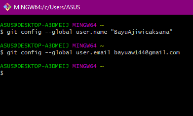
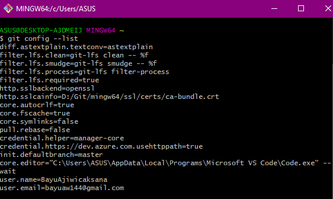

# Konfigurasi Git

Konfigurasi Git ini memberitahu Git tentang username serta email yang diperlukan untuk melakukan perubahan file pada Repo di GitHub nantinya.

Command untuk konfigurasi *username* dan *email* :

Isi file config :

