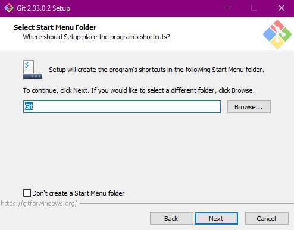

# Instalasi Git

1. Double klik pada file Git yang telah di download. Kemudian klik **Next**.

2. Pilih lokasi instalasi. Saya memilih lokasi di **D:\Git**. Kemudian klik **Next**.

3. Tidak perlu mengubah komponen, biarkan dalam keadaan default. Klik **Next**.

4. Lanjut klik **Next**.

5. Pilih editor default untuk Git. Kemudian klik **Next**.

6. Pilih **Let Git Decide** untuk membiarkan Git memmberi nama *Branch* saat sebuah Repo pertama kali dibuat. Klik **Next**.

7. Pilih pilihan ke-2, agar Git tidak hanya dapat digunakan di Git Bash, namun juga pada *Command Prompt* dan Software pihak ketiga lainnya. Klik **Next**.

8. Pilih **Use bundled OpenSSH** agar Git menggunakan SSH bawaannya. Klik **Next**.

9. Pilih **OpenSSL** untuk HTTPS. Klik **Next**.

10. Pilih **Checkout Windows-Style**. Klik **Next**.

11. Pilih **MinTTY** untuk terminal Git Bash. Klik **Next**.

12. Untuk *behavior* dari *git pull* , biarkan pada **Default**. Klik **Next**.

13. Pada *Credentials Helper* biarkan pada default, yaitu **Git Credentials Manager Core**. Klik **Next**.

14. Biarkan pada defaultnya. Klik **Next**.

15. Biarkan pada defaultnya, yaitu tidak ada yang dipilih. Klik **Next**.

16. Pada defaultnya, *View Release Note* akan tercentang, namun saya tidak mencetang pilihan tersebut, dan langsung klik **Finish**.

