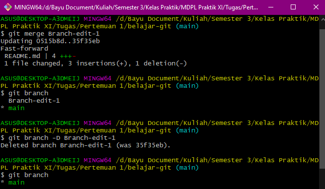

# Mengelola Repo

## Personal Access Token (PAT)

GitHub mengumumkan, bahwa mulai 13 Agustus 2021, penggunan token merupakan [kewajiban untuk semua akses ke GitHub yang memerlukan otentikasi](https://github.blog/2020-12-15-token-authentication-requirements-for-git-operations/). Sehingga, dalam mengelola Repo kita di GitHub, wajib mengaktifkan token. Cara mengaktifkan token :

1. Di bagian profile, pilih **Settings**.

2. Kemudian pilih Tab **Developer Settings**.

3. Pilih **Personal Access Token**. Disini saya sudah memiliki token, dengan nama *belajar*. Defaultnya kosong, sehingga kita perlu men-**generate new token**.

4. Kemudian kita diminta untuk mengisi nama dari token tersebut, masa berlakunya, dan *scopes* dari tokennya

5. Kemudian klik **Generate Token**. Kemudian token akan muncul. Simpan token tersebut dengan baik, perlakukan layaknya sebuah password. Token ini akan digunakan ketika kita mengelola Repo kita di GitHub melalui Repo di lokal.

## Membuat Repo di GitHub

Cara membuat Repo di GitHub :

1. Di pojok kanan atas, klik tanda **+**, kemudian klik **New Repository**.

2. Kemudian beri nama untuk Repo nya, Deskripsi repo, visibilitas repo nya (*Public / Private*). Kemudian kita bisa menambahkan file *markdown* README, dan lisensi, namun pada contoh ini saya kosongkan semua, sehingga hanya menghasilkan Repo yang kosong. Klik **Create Repository**.

3. Setelah repo jadi, tampilannya akan seperti berikut, langkah selanjutnya yaitu, kita melakukan *clone* (duplikasi) dari Repo GitHub ke Repo Lokal. Caranya kita *copy* link repository kita di bagian atas sebelah kanan

## Melakukan Cloning

4. Kemudian kita buka terminal (disini saya menggunakan Git Bash, namun bisa juga menggunakan cmd, atau jika menggunakan VSCode, bisa menggunakan terminal dari VSCode nya). Secara default, *working directory* kita berada di *C:/Users/(nama user)/*, namun disini saya mengubah nya ke tempat lain (directory yang berwarna kuning). Selanjutnya kita akan melakukan *clone* dengan command : **git clone (*paste*-kan link repo yang sudah di*copy* tadi)**. Kemudian klik **enter**.

5. Karena Repo kita kosong, maka akan terdapat *warning* yang mengatakan bahwa kita menduplikasi repo yang kosong. Ini tidak masalah, karna kita akan mengisinya melalui Repo Lokal yang nantinya akan kita kirim (*push*) ke Repo GitHub. Setelah melakukan *clone*, *working directory*-nya belum berada di dalam folder Repo kita, maka kita harus masuk ke Repo, dengan menggunakan command : **cd (nama folder Repo)**. Setelah masuk ke dalam folder Repo, secara otomatis kita akan menggunakan *branch* : **master**. Disini saya akan merubah nama *branch*-nya menjadi **main**, dengan command : **git branch -m (nama branch baru)**.

### Membuat File di Repo Lokal

6. Kemudian kita akan membuat file didalam Repo lokal kita, disini saya membuat file *markdown* .md (bisa **.txt, .py, .js**, dll. sesuai keinginan) dengan menggunakan editor VS Code. Di editor tersebut kita isi file nya, bebas, kemudian kita *save*. Kembali ke terminal, gunakan **cat (nama file)** untuk menampilkan isi file yang baru dibuat. **git status** akan menampilkan status folder Repo kita, disitu terlihat ada file README.md yang berwarna merah, yang artinya file tersebut belum disimpan (*commit*) ke folder Repo lokal kita

7. Sebelum file tadi disimpan (*commit*) ke Repo lokal kita, file tersebut harus masuk ke dalam *Staging Area* terlebih dahulu. Caranya dengan menggunakan command : **git add -A**. Jika kita melihat status repo kita, maka file README.md yang tadinya berwarna merah, sekarang berubah menjadi hijau yang menandakan file tersebut sudah masuk dalam *Staging Area*, dan siap untuk disimpan (*commit*) di Repo Lokal kita. Untuk menyimpan (*commit*) file nya, gunakan command : **git commit -m "(komentar tentang commit yang dilakukan)"**.

### Melakukan *push* ke Repo GitHub

8. File README.md yang telah kita *commit* tadi, hanya terdapat pada Repo Lokal kita, sedangkan Repo GitHub kita masih kosong. Untuk mengirim/menyimpan file tersebut ke Repo GitHub, gunakan command : **git push -u origin main**. Parameter **-u** bertujuan untuk men-*setting* upstream *branch* nya.

9. Buka GitHub kita, kemudian refresh halaman webnya, maka seharusnya file README.md sudah berada di Repo GitHub kita.

## Branching dan Merging

Ketika melakukan branching, semua file yang terdapat di branch utama akan tersalin ke branch yang baru. Branching bertujuan untuk memungkinkan pengembangan fitur baru untuk *project* kita tanpa mengganggu pengembangan di branch utama (branch utama pada Repo diatas yaitu : **main**).

Untuk melakukan branching, kita harus membuat branch nya terlebih dahulu menggunakan command : **git branch (nama branch baru)**. Untuk berpindah branch menggunakan command : **git checkout (nama branch)**. Atau, jika kita ingin membuat branch baru dan langsung berpindah branch, gunakan command : **git checkout -b (nama branch baru)**. Parameter **-b** untuk membuat branch baru. Disini kita akan mencoba mengedit file README.md yang sudah dibuat dengan menggunakan branch baru.

### Branching

1. Pertama-tama kita membuat dan berpindah ke branch baru, disini saya memberi nama branch barunya dengan nama : *Branch-edit-1*. Kemudian kita mengedit file README.md dengan editor. Setelah itu kita tampilkan di terminal hasil editannya.

2. Jika kita lihat status Repo nya, maka disitu file README.md menjadi warna merah, namun diberi keterangan *modified*, karena file README.md tersebut sudah ada, hanya isi filenya saja yang berubah. Maka file tersebut kita masukkan ke *Staging Area* dan kita *Commit* perubahannya.

3. Untuk melihat branch apa saja yang telah dibuat, gunakan command : **git branch**. Branch yang sedang aktif (sedang digunakan) akan ditandai dengan tanda bintang dan berwarna hijau. Selanjutnya perubahan pada file README.md di branch *Branch-edit-1* akan kita gabungkan (*Merge*) ke file README.md pada branch utama (**main**), kita akan melakukan merging di Repo GitHub, sehingga kita harus membuat *Pull Request* ke branch utama terlebih dahulu. Kita akan berpindah branch ke branch utama (**main**) dan melihat statusnya.

4. Kita akan melakukan *push*, untuk membuat *Pull Request*

### Merging di Repo GitHub

1. Selanjutnya, buka GitHub, maka disana akan terdapat sebuah *Pull Request* dari *Branch-edit-1* dengan pesan *commit* yang sama ketika kita melakukan *commit* sebelumnya. GitHub akan mengecek perubahan pada file README.md nya, dan jika bisa di merge, akan ada pesan dengan tanda (✓) dan kalimat *Able to Merge*. Klik **Create Pull Request**.

2. GitHub akan mengecek apakah *commit* pada file README.md yang dibuat pada *Branch-edit-1* menciptakan konflik dengan file README.md, jika tidak ada konflik maka bisa merge bisa dilakukan

3. Konfirmasi merge yang dilakukan

4. Tampilan jika merge berhasil dilakukan

### Merging di Repo Lokal

1. Kita telah melakukan merge, namun merge tersebut untuk Repo pada GitHub, kita perlu melakukan merge pada Repo Lokal kita juga, dengan menggunakan command : **git merge (nama branch yang melakukan perubahan)**. Setelah berhasil dimerge, jika branch *Branch-edit-1* dirasa tidak diperlukan lagi kita bisa menghapus branch tersebut, dengan command : **git branch -D (nama branch yang akan dihapus)**.

2. Kemudian kita harus melakukan sinkronisasi, antara Repo Lokal dan Repo GitHubnya, dengan command : **git pull**.

## Membatalkan Perubahan

1. Kita akan membuat kasus dimana kita membatalkan perubahan pada sebuah file. Kita akan membuat branch baru dengan nama *Branch-edit-2* yang akan melakukan perubahan, dan  branch utama (**main**) yang akan membatalkan perubahan tersebut. Kita akan mengedit file README.md dengan *Branch-edit-2*.

2. Tanpa melakukan *Staging* (**git add**), kita langsung berpindah branch ke **main**. Akan muncul pesan, **M     README.md**, yang artinya file README.md masih dalam keadaan *modified*. Kemudian kita tampilkan isi file README.md tadi, maka perubahan yang dilakukan oleh *Branch-edit-2* masih ada. Kemudian kita hapus branch tersebut dan melihat kembali, apakah perubahan yang dilakukan *Branch-edit-2* masih ada.

3. Setelah dicek, ternyata perubahan yang dilakukan masih ada, maka untuk membatalkannya, gunakan command : **git reset --hard**. Maka file akan dikembalikan dalam keadaan sebelum dilakukan perubahan.

## Undo Commit

1. Kasus selanjutnya yaitu mengembalikan kondisi file setelah melakukan *commit*. Silahkan melakukan perubahan pada file sebanyak 2x dan di *commit*, kemudian tampilkan

2. Kemudian untuk melakukan undo, gunakan command : **git revert HEAD**. Setelah itu editor akan terbuka, untuk menampilkan pesan revert, save dan keluar.

3. Tampilan setelah melakukan undo. Lakukan *Push*.

## Me-*Resolve* Konflik

Jika kita mencoba untuk kembali ke perubahan yang lama, ada kemungkinan untuk terjadi konflik. Kita akan coba untuk membuat konflik dan mencoba untuk me-*resolve* nya.

1. Silahkan melakukan perubahan pada file sebanyak 2x dan di *commit*, kemudian tampilkan dan lihat **log** nya dengan command : **git log --oneline**, kemudian lakukan *revert* pada posisi *commit* yang diinginkan dengan menggunakan kode *commit* nya (yang berwarna kuning, disebelah kiri).

2. Akan muncul peringatan bahwa ada konflik dan kita diminta untuk me-*resolve* nya. Tampilkan isi filenya, kemudian buka editor untuk me-*resolve* nya

3. Lihat status nya, file masih dalam kondisi *modified* dan *Unmerged*, maka kita masukkan ke *Staging*, setelah itu kita lanjutkan proses *revert* nya, dengan command : **git revert --continue**.

4. Setelah itu kita *Push* ke Repo GitHub kita

